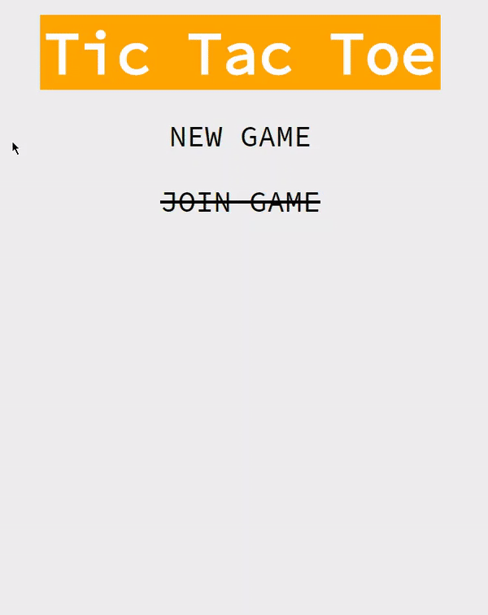

# tic-tac-toe-python-flask
* This is an implementation to showcase minimax algorithm using its classic application on tic tac toe (Noughts and Crosses) game. 

* The algorithm works by minimising the possible loss caused by the opponent, whose goal is to maximise the opportunity to win the game.

* Uses React SPA for GUI, and the Flask server running this algorithm for game decision. 

# Preview

 
*Gameplay of the player vs AI*

# Technology Used
## Back-end
* Python
    * Flask
    * Socket-IO

## Front-end
* React (Class Components)
* Axios
* Socket-IO client

# Build
## Front-end
* Navigate to the *static-src* folder and run `npm install` to get all the dependencies
* Create the build using `npm run build`

## Back-end
* Firstly create a virtual environment using
`virtualenv env` 
you can use any name, but you get the idea. 
* Activate your virtual environment using
`source env/bin/activate`
* Navigate to the root directory and install all the dependencies using
`pip install -r requirements.txt`
* Then run the server: `python server.py`  
**NOTE:** This might take some time, depending on your hardware spec, since the server must load the game tree containing all the possible moves.
* Finally, using your favourite browser, go to http://localhost:5000 (the default port of Flask), and you should see the game running!